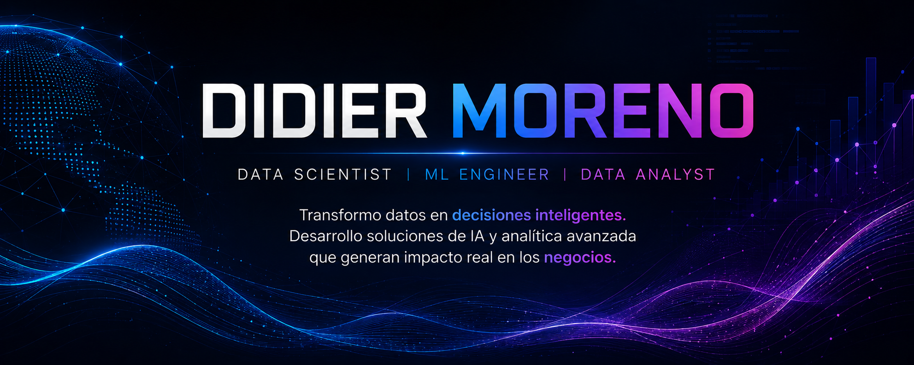

  

# 👨‍💻 Sobre mí

- 🎓 Ingeniero Electrónico.
- 🤖 Apasionado por la Inteligencia Artificial, el Machine Learning y la Ciencia de Datos.
- 📊 Enfocado en Analítica de Datos e Inteligencia de Negocios.
- 🧠 Experiencia en investigación aplicada a la clasificación de arritmias mediante Redes Neuronales Convolucionales (CNN).
- 🌱 Actualmente desarrollando aplicaciones inteligentes impulsadas por IA para resolver problemas reales de negocio.

---

<h2 align="center">💻 Tecnologías</h2>

---

<h2 align="center">🚀 Proyectos Destacados</h2>

<table>

<tr>

<td width="50%" align="center">

### ☕ El Cafecito POS

Sistema inteligente para la gestión de inventario, ventas, clientes y analítica de negocios.

</td>

<td width="50%" align="center">

### 📊 Selligent Labs

Plataforma inteligente para el análisis de ventas y generación de indicadores de negocio.

  

</td>

</tr>

<tr>

<td width="50%" align="center">

### 🫀 Clasificación de Arritmias

Artículo científico publicado sobre clasificación interpretable de arritmias cardíacas mediante Redes Neuronales Convolucionales (CNN).

  

</td>

<td width="50%" align="center">

### 🧠 Red Neuronal Multimodal

Modelo multimodal para la clasificación de arritmias utilizando señales ECG y datos tabulares.

  

</td>

</tr>

</table>

---

# 📫 Contacto

- 📧 **Correo:** 21.djmo@gmail.com
- 💼 **LinkedIn:** https://www.linkedin.com/in/didier-moreno-934696371
- 🌐 **GitHub:** https://github.com/Didier-Moreno

---

### ⭐ Transformando datos en soluciones inteligentes para impulsar mejores decisiones de negocio.

